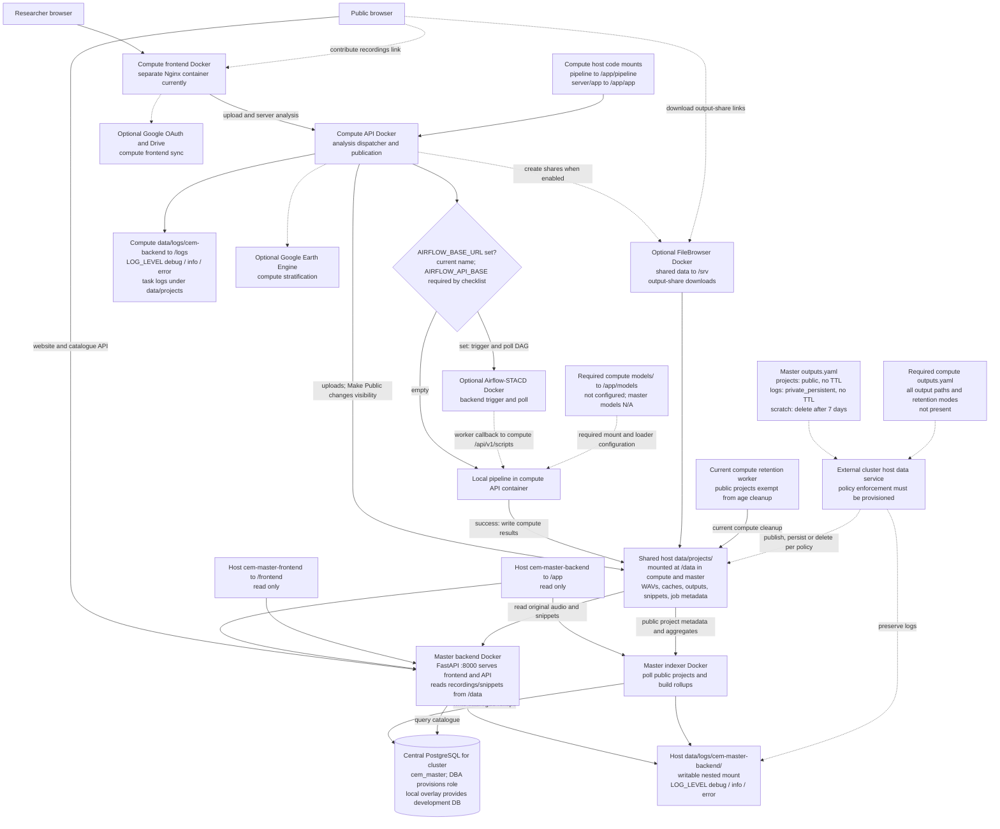

# CEM Master backend

Public catalogue API, static master website, PostgreSQL catalogue, and background
indexer for Continuous Ecological Monitoring.

## What the System Does

The master website is the central public showcase for continuous ecological and bioacoustic monitoring:

- **Interactive Spatial Map**: Explores monitoring spots across projects, color-coded by detection intensity, with cluster spiderfying for overlapping multi-project coordinates.
- **Species Discovery & Showcase**: Instant search across common and scientific names, showing species network occurrence, IUCN conservation status, migration classification, taxonomy, and the **global highest-confidence 9-second focal call snippet**.
- **Spot-Level Bioacoustics**:
  - **Species Richness & Bird Inventory**: Detection counts, active days, and row-level `[ 9s ]` audio call audition buttons.
  - **24-Hour Diurnal Activity Chart**: Hourly detection curves showing dawn/dusk calling patterns.
  - **24-Hour Species Heatmap Matrix**: Normalized hourly activity heatmap for the top 20 most active species.
  - **Soundscape Indices**: ACI (Acoustic Complexity), ADI (Diversity), AEI (Evenness), NDSI, Bioacoustic Index (BIO), and MFC.
  - **Seasonal & Solar Metrics**: Seasonal Concentration Index (SCI), Peak-to-Median Ratio (PMR), Kurtosis, and sunrise/weather correlations.
- **Raw Audio Recordings Browser**: Paginated raw audio files with visual waveform playback.
- **Analysis Provenance & Downloads**: Links completed analysis runs directly to FileBrowser output downloads.
- **Master Indexer**: Continuously monitors `DATA_DIR/projects/`, automatically computes spot and species rollups from BirdNET detection tables, registers 9s audio snippets, and safely filters sensitive/endangered IUCN species (fail-closed).

## Architecture Diagram

The master serves the public website and catalogue; researchers trigger compute
through the separate compute UI. Dotted arrows indicate optional integrations
or required changes rather than installed services.


```mermaid
flowchart TB
    Public["Public browser"]
    Researcher["Researcher browser"]
    ComputeUI["Compute frontend Docker<br/>separate Nginx container currently"]
    Compute["Compute API Docker<br/>analysis dispatcher and publication"]
    Dispatch{"AIRFLOW_BASE_URL set?<br/>current name; AIRFLOW_API_BASE required by checklist"}
    Airflow["Optional Airflow-STACD Docker<br/>backend trigger and poll"]
    Local["Local pipeline in compute API container"]
    CodeCompute["Compute host code mounts<br/>pipeline to /app/pipeline<br/>server/app to /app/app"]
    Models["Required compute models/ to /app/models<br/>not configured; master models N/A"]
    Data["Shared host data/projects/<br/>mounted at /data in compute and master<br/>WAVs, caches, outputs, snippets, job metadata"]
    ComputeLogs["Compute data/logs/cem-backend to /logs<br/>LOG_LEVEL debug / info / error<br/>task logs under data/projects"]
    GEE["Optional Google Earth Engine<br/>compute stratification"]
    Drive["Optional Google OAuth and Drive<br/>compute frontend sync"]
    App["Master backend Docker<br/>FastAPI :8000 serves frontend and API<br/>reads recordings/snippets from /data"]
    Indexer["Master indexer Docker<br/>poll public projects and build rollups"]
    MasterCode["Host cem-master-backend to /app<br/>read only"]
    Frontend["Host cem-master-frontend to /frontend<br/>read only"]
    DB[("Central PostgreSQL for cluster<br/>cem_master; DBA provisions role<br/>local overlay provides development DB")]
    Logs["Host data/logs/cem-master-backend/<br/>writable nested mount<br/>LOG_LEVEL debug / info / error"]
    FB["Optional FileBrowser Docker<br/>shared data to /srv<br/>output-share downloads"]
    Sweep["Current compute retention worker<br/>public projects exempt from age cleanup"]
    Policy["Master outputs.yaml<br/>projects: public, no TTL<br/>logs: private_persistent, no TTL<br/>scratch: delete after 7 days"]
    ComputePolicy["Required compute outputs.yaml<br/>all output paths and retention modes<br/>not present"]
    HostService["External cluster host data service<br/>policy enforcement must be provisioned"]

    Researcher --> ComputeUI
    ComputeUI -->|"upload and server analysis"| Compute
    ComputeUI -.-> Drive
    Compute --> Dispatch
    Dispatch -->|"empty"| Local
    Dispatch -->|"set: trigger and poll DAG"| Airflow
    Airflow -.->|"worker callback to compute /api/v1/scripts"| Local
    CodeCompute --> Compute
    Models -.->|"required mount and loader configuration"| Local
    Compute -->|"uploads; Make Public changes visibility"| Data
    Local -->|"success: write compute results"| Data
    Compute --> ComputeLogs
    Compute -.-> GEE
    Public -->|"website and catalogue API"| App
    Public -.->|"contribute recordings link"| ComputeUI
    MasterCode --> App
    MasterCode --> Indexer
    Frontend --> App
    Data -->|"public project metadata and aggregates"| Indexer
    Data -->|"read original audio and snippets"| App
    Indexer -->|"write catalogue rollups"| DB
    App -->|"query catalogue"| DB
    App --> Logs
    Indexer --> Logs
    Compute -.->|"create shares when enabled"| FB
    Public -.->|"download output-share links"| FB
    FB --> Data
    Sweep -->|"current compute cleanup"| Data
    Policy -.-> HostService
    ComputePolicy -.-> HostService
    HostService -.->|"publish, persist or delete per policy"| Data
    HostService -.->|"preserve logs"| Logs
```

Master does not run BirdNET and has no model weights. Compute's required model
mount is shown as missing, rather than suggesting it is already provisioned.
Airflow dispatch currently uses `AIRFLOW_BASE_URL`; worker callback routing must
be configured separately. See the
[compute architecture](https://github.com/err400/cem-backend/blob/master/README.md#architecture-diagram)
for execution details and the separate browser-local watcher option.

`outputs.yaml` declares master retention categories; Compose does not run the
host data service or enforce that policy. Compute has an independent cleanup
worker and still needs its own host-service policy. Cluster deployment uses
central PostgreSQL; the bundled PostgreSQL overlay is for local development or
the separately documented single-server installation, not cluster provisioning.

## Directory Mounts & Volume Layout

The Docker image contains runtime dependencies only (`requirements.txt`). Code, frontend assets, and data live on the host and are bind-mounted at runtime:

| Host Folder | Container Path | Purpose & Lifecycle |
| :--- | :--- | :--- |
| `.` (repo checkout) | `/app:ro` | Backend code, scripts, and Alembic migrations. Apply migrations when needed and restart after code updates; rebuild for dependency changes. |
| `${MASTER_FRONTEND_CONTEXT:-../cem-master-frontend}` | `/frontend:ro` | Frontend HTML/JS/CSS assets, served directly by FastAPI on `/`. |
| `${CEM_DATA_DIR_HOST}` | `/data:ro` | Shared compute datasets (`/data/projects/`). Mounted read-only for public catalog indexing and 9s audio streaming. |
| `${CEM_DATA_DIR_HOST}/logs/cem-master-backend` | `/data/logs/cem-master-backend:rw` | Application and ASGI diagnostic logs (`app.log`). |
| *(models)* | *N/A* | The master catalog performs database indexing and aggregation; no AI/ML weight checkpoints (.pt / .onnx) are used. |

## Local setup

Start with [Local setup: clone → configure → migrate → run](https://github.com/err400/cem-master-backend/blob/main/docs/local-setup.md).
It includes the repository links, commands and clickable localhost URLs.
For local setup you only need the local steps; skip production configuration.

## Setup and deployment

Start with [CEM_SETUP_GUIDE.md](https://github.com/err400/cem-master-backend/blob/main/CEM_SETUP_GUIDE.md). It contains the four repository
clone commands, complete environment reference, private credential generation,
Alembic steps, local/server startup, deployment URLs and proxy-prefix checks.
Copying `.env.example` alone is not a production setup.

| Service | Role | Local address |
|---|---|---|
| `backend` | FastAPI API, frontend assets and audio streaming | http://localhost:8000 |
| `indexer` | Polls public compute projects and writes catalogue rows | No public port |
| `cem-database` | PostgreSQL, supplied by `compose.local.yaml` | Host port 5432 by default |

The frontend is mounted from `cem-master-frontend` at `/frontend`; do not start a
separate master frontend container. Compute writes the shared data folder;
master backend and indexer mount it read-only at `/data`, with a writable nested
log directory. Database changes are managed by Alembic, not `create_all`.

The base `compose.yaml` expects a provisioned database and does not run migrations.
The local overlay adds PostgreSQL and API startup migrations. Follow the guide's
explicit migration-before-indexer sequence and production command overlay.

## Deployment addresses

- Master UI: https://www.cse.iitd.ernet.in/act4dws5/bio-master/
- Compute UI: https://www.cse.iitd.ernet.in/act4dws5/bio/
- Current master `API_BASE_URL`: `https://www.cse.iitd.ernet.in/act4dws5/bio-master/api`
- CORS origin: `https://www.cse.iitd.ernet.in` (no path).

The deployed proxy adds `/api` before the backend's `/api/v1` routes. For example,
the public spots endpoint is `/act4dws5/bio-master/api/api/v1/spots`.
Local requests use `/api/v1/spots` on port 8000. Reconfirm routing when changing
the proxy; the compute API base must be confirmed independently of its UI URL.

## Publication and indexing

Compute server analysis writes project outputs and spot coordinates. Make Public
updates project visibility. The indexer reads public projects from the same
physical folder and populates spots, species, detections, analytics, recordings,
and available snippet/download references. Unpublished projects are removed
from the public catalogue on a subsequent indexing pass.

For an already configured local installation, run from this directory:

```bash
docker compose -f compose.yaml -f compose.local.yaml exec -T backend \
  python -m app.indexer --data-dir /data --all --dry-run
docker compose -f compose.yaml -f compose.local.yaml exec -T backend \
  python -m app.indexer --data-dir /data --all
```

Production commands must include the deployment's overlay as described in the
setup guide. A recording row is metadata; successful playback additionally
requires the original WAV to be accessible in the backend's `/data` mount.

## Master Indexer & Data Flow

Species search and analytics span all public projects, so heavy aggregation happens during indexing, not during user page requests.

### What the Indexer Does:
1. Walks `DATA_DIR/projects/` and checks `project.json` (only indexing projects where `visibility == "public"`).
2. Reads detection aggregates (`aggregate.csv`), normalizes species names, and filters sensitive/endangered IUCN categories (fail-closed).
3. Computes:
   - **Spot Summaries**: Species richness, total detections, active recording days.
   - **Spot Species Summaries**: Per-bird detection counts, active days, 24-hour hourly activity array `[0..23]`, and daily/monthly time series.
   - **Multi-Project Spots**: When multiple projects monitor the same GPS location (e.g. `IITDELHI`), each project gets its own distinct `Spot` record with unmixed hourly counts (spiderfied cleanly on the map).
   - **9-Second Audio Snippets**: Ingests `snippets/species_snippets.json`, attaching spot-level snippets to each bird, and updating the global all-time highest-confidence showcase in `Species`.
   - **Soundscape & Ecological Indices**: Attaches ACI, ADI, AEI, NDSI, SCI, PMR, and Kurtosis metrics.
   - **Analysis Jobs**: Registers completed runs and FileBrowser download links.
4. **Idempotent & Pruning**: Re-indexing unchanged projects changes nothing; removed or unpublished projects are cleanly pruned from the database.

### Running the Indexer Manually:

```bash
./scripts/reindex.sh                     # index all public projects
./scripts/reindex.sh --dry-run           # dry run report (writes nothing)
./scripts/reindex.sh --project YOUR_PROJECT    # index a single project
```

These helper commands target the local Compose stack. For production, use
the equivalent `python -m app.indexer` command with the deployment overlays
from [CEM_SETUP_GUIDE.md](https://github.com/err400/cem-master-backend/blob/main/CEM_SETUP_GUIDE.md).

## API reference


The FastAPI backend exposes the following REST routes (prefixed with `/api/v1`):

### 1. Spots & Spatial Discovery
| Method & Endpoint | Description |
| :--- | :--- |
| `GET /api/v1/spots` | GeoJSON FeatureCollection of public monitoring spots with coordinates, species richness, and total detections. Supports filtering by `species_id`, `migration_class`, `start_date`, and `end_date`. |
| `GET /api/v1/spots/{spot_id}` | Metadata for a single spot (ID, name, project ID, GPS coordinates). |
| `POST /api/v1/spots` | Administrative endpoint to register a spot (requires `X-API-Key` when a backend API key is configured). |

### 2. Spot Analytics & Species Details
| Method & Endpoint | Description |
| :--- | :--- |
| `GET /api/v1/spots/{spot_id}/summary` | Comprehensive spot dossier: species richness, total detections, active days, soundscape indices (ACI, ADI, AEI, NDSI, BIO), 24h diurnal activity array, bird inventory with 9s call URLs, and analysis assets. |
| `GET /api/v1/spots/{spot_id}/species/{species_id}` | Detailed observation of a bird at a spot: detection count, active days, confidence metrics, 24h calling curve, daily time series, bioacoustic/solar metrics (SCI, PMR, Kurtosis, sunrise correlation), 9s focal call snippet, and analysis jobs with download links. |

### 3. Species Catalog & Global Showcase
| Method & Endpoint | Description |
| :--- | :--- |
| `GET /api/v1/species` | Search and list public bird species. Supports query search (`?search=`), migration class filter (`?migration_class=`), and returns each species with its global best 9s call snippet. |
| `GET /api/v1/species/{species_id}` | Global showcase for a species: common/scientific name, IUCN status, image & attribution, migration class, taxonomy, and the all-time highest confidence 9s audio snippet across all projects. |

### 4. Audio Streaming & Snippets
| Method & Endpoint | Description |
| :--- | :--- |
| `GET /api/v1/projects/{project}/snippets/{filename}` | Streams a 9-second focal call snippet `.wav` file with byte-range support (`Accept-Ranges: bytes`) for instant browser playback. |
| `GET /api/v1/recordings/{audio_id}/stream` | Streams a full raw audio recording `.wav` file from disk. |

### 5. Recordings Browser
| Method & Endpoint | Description |
| :--- | :--- |
| `GET /api/v1/spots/{spot_id}/recordings` | Paginated raw audio recordings captured at a spot with date/time filters, detection counts, and species tags. |
| `GET /api/v1/spots/{spot_id}/species/{species_id}/recordings` | Paginated raw audio recordings containing detections for a specific bird at a spot. |

### 6. Environment & System
| Method & Endpoint | Description |
| :--- | :--- |
| `GET /api/v1/spots/{spot_id}/environment` | Daily environmental history: sunrise/sunset times, rainfall mm, temperature min/max/mean, humidity, and severe weather indicators. |
| `GET /api/v1/rankings/threatened-spots` | Ranking of monitoring spots ordered by presence of vulnerable/threatened species (IUCN VU). |
| `POST /api/v1/indexer/projects/{project}` | Trigger on-demand re-indexing for a specific project. |
| `GET /health` | Database connection and API health status. |

## Code Structure

```text
cem-master-backend/
├── app/
│   ├── main.py          FastAPI startup, static assets and runtime config
│   ├── config.py        Environment settings
│   ├── database.py      PostgreSQL engine and sessions
│   ├── models.py        Catalogue models
│   ├── routes/          Spot, species, recording and indexer endpoints
│   └── indexer/         Project reader, rollups and database writer
├── migrations/          Alembic migration history
├── scripts/             Startup, reindexing, seeding and development helpers
├── tests/               PostgreSQL integration and rollup tests
├── compose.yaml         API/indexer with externally provisioned database
├── compose.local.yaml   Local PostgreSQL and startup migration overlay
└── outputs.yaml         Cluster host-data-service lifecycle policy
```

## Development and maintenance

Runtime dependencies are in `requirements.txt`; tests additionally need
`requirements-dev.txt` and a separate PostgreSQL test database. The runtime image
does not install pytest. Do not generate migrations in the read-only container
checkout: use a host virtualenv with a configured development database, review
the generated migration, then apply it with `python -m alembic upgrade head`.

Backend source is mounted read-only at `/app`. Rebuild after dependency changes;
apply migrations before starting updated API/indexer services. Environment and
mount changes require container recreation. Back up the database and shared
data before production updates; `down -v` deletes the database volume.

## Output Retention (`outputs.yaml`)

Output lifecycle policies under `data/` are declared in [`outputs.yaml`](https://github.com/err400/cem-master-backend/blob/main/outputs.yaml) for integration with a cluster **Host Data Service**, when that service is configured:

- **`data/projects/`** (`mode: public`, `ttl_days: null`): Public project datasets, detection summaries, acoustic indices, and 9-second bird call audio snippets.
- **`data/logs/cem-master-backend/`** (`mode: private_persistent`, `ttl_days: null`): Persistent application and ASGI diagnostic log files (`app.log`).
- **`data/scratch/`** (`mode: delete`, `ttl_days: 7`): Ephemeral working files and temporary data; declares a 7-day deletion policy for the host data service.

Compose does not enforce `outputs.yaml` by itself. Compute has its own
retention worker configured through `RETENTION_HOURS`; it owns original recordings
and job outputs. Keep these policies consistent with the deployed storage plan.

## Helpful Scripts

| Script | Purpose |
| :--- | :--- |
| `scripts/dev-up.sh` | Start, stop, or rebuild the master stack (`-d`, `down`; `down -v` deletes the database). |
| `scripts/reindex.sh` | Trigger indexing on demand for all or specific projects. |
| `scripts/seed_spots.py` | Insert sample monitoring spots for testing without raw audio data. |
| `scripts/dev_compute_e2e.py` | End-to-end testing loop: raw audio → BirdNET → publish → index → map. |
| `tests/fixtures/build_fixture.py` | Generate a synthetic `DATA_DIR` fixture for automated tests. |

## Documentation

- [Setup and environment reference](https://github.com/err400/cem-master-backend/blob/main/CEM_SETUP_GUIDE.md)
- [Publication and indexer troubleshooting](https://github.com/err400/cem-master-backend/blob/main/docs/first-time-local-publication.md)
- [Testing and user workflow](https://github.com/err400/cem-master-backend/blob/main/HOW_TO_TEST.md)
- [Backend logging](https://github.com/err400/cem-master-backend/blob/main/DEBUGGING.md)
- [Master frontend](https://github.com/err400/cem-master-frontend)
- [Compute backend](https://github.com/err400/cem-backend)
- [Compute frontend](https://github.com/err400/cem-frontend)
